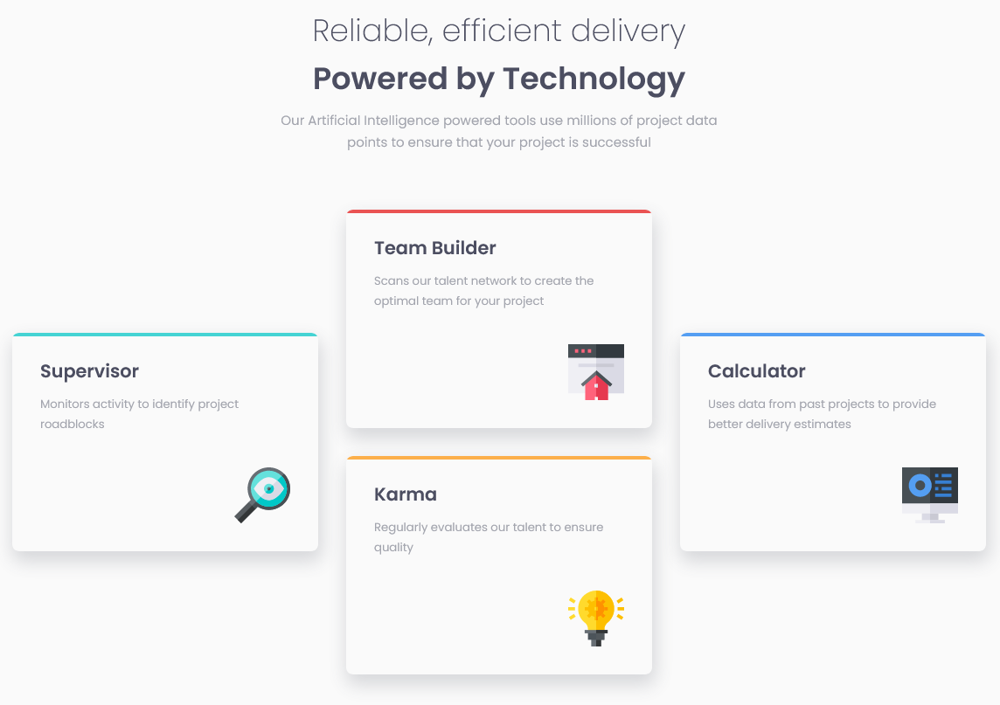

# Frontend Mentor - Four card feature section solution

This is a solution to the [Four card feature section challenge on Frontend Mentor](https://www.frontendmentor.io/challenges/four-card-feature-section-weK1eFYK). Frontend Mentor challenges help you improve your coding skills by building realistic projects. 

## Table of contents

- [Overview](#overview)
  - [The challenge](#the-challenge)
  - [Screenshot](#screenshot)
  - [Links](#links)
  - [Built with](#built-with)
  - [What I learned](#what-i-learned)
  - [Useful resources](#useful-resources)
- [Author](#author)

## Overview

### The challenge

Users should be able to:

- View the optimal layout for the site depending on their device's screen size

### Screenshot

### Links

- Solution URL: [My solution](https://your-solution-url.com)
- Live Site URL: [Live preview](https://your-live-site-url.com)

### Built with

- Semantic HTML5 markup
- CSS custom properties
- Flexbox
- CSS Grid

### What I learned

To create a specific design with CSS grid layout, to use `::before` to add a line on the top of the cards and use `[data]` to apply a style (a specific color) depending on the word used in this ´data´.

### Useful resources

- [Youtube video](https://www.youtube.com/watch?v=EiNiSFIPIQE) - A video about css grid, by "Slaying The Dragon".
- [Link to the css reset](https://piccalil.li/blog/a-more-modern-css-reset/) - I used a reset style by Andy Bell on this project

## Author

- Frontend Mentor - [@yourusername](https://www.frontendmentor.io/profile/Divadovitch)

